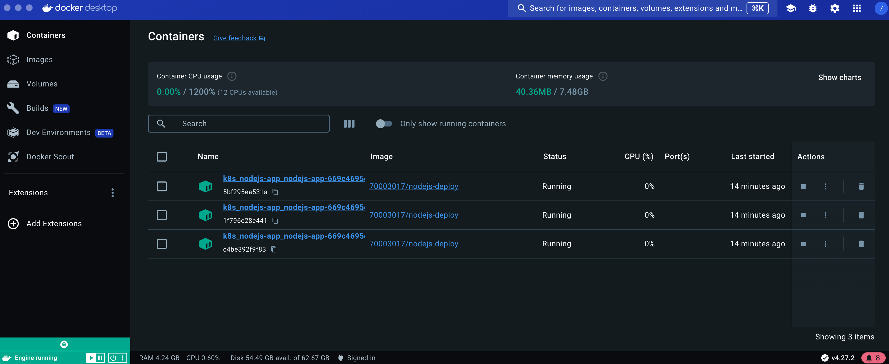
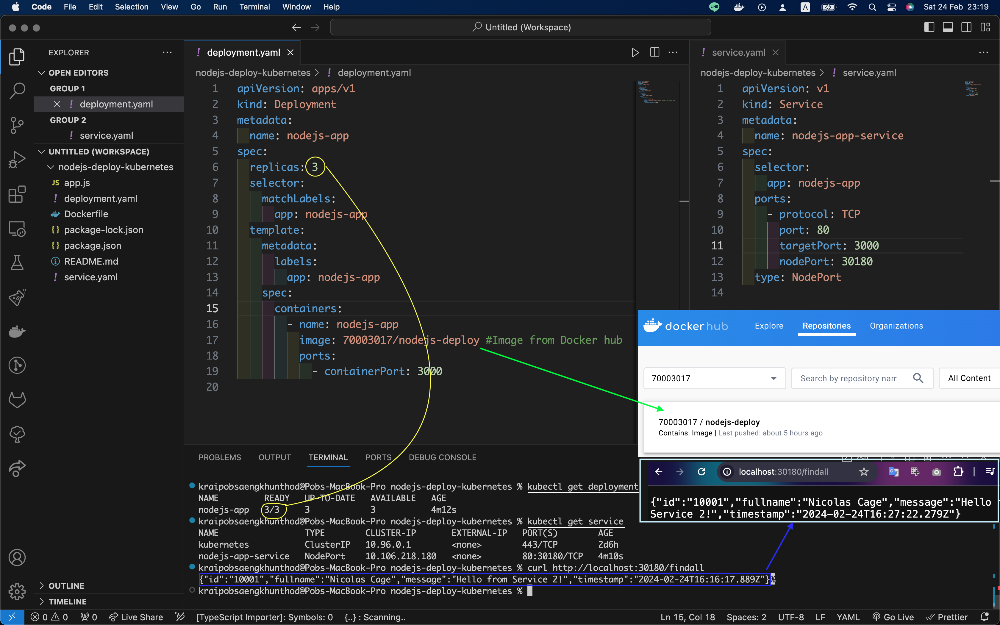

## Deploy a simple Node.js application to Kubernetes using Docker.

1. Build the Docker image: `docker build -t nodejs-deploy .`
2. Push the image to DockerHub: `docker push 70003017/nodejs-deploy`
3. Apply the deployment configuration: `kubectl apply -f deployment.yaml`
4. Apply the service configuration: `kubectl apply -f service.yaml`

